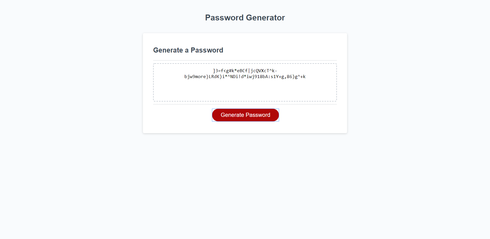
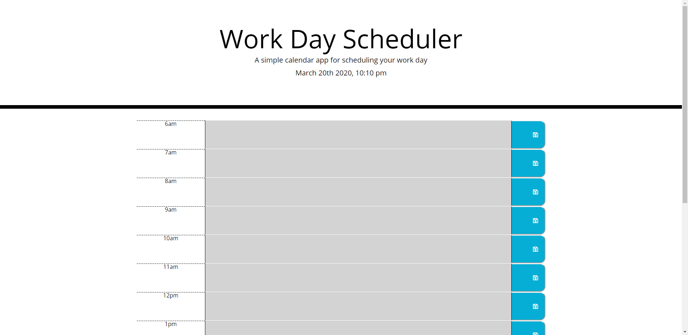
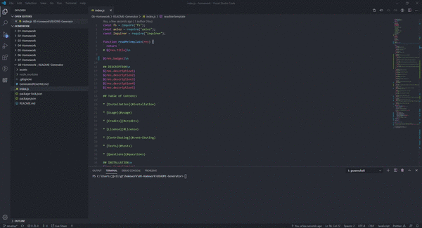
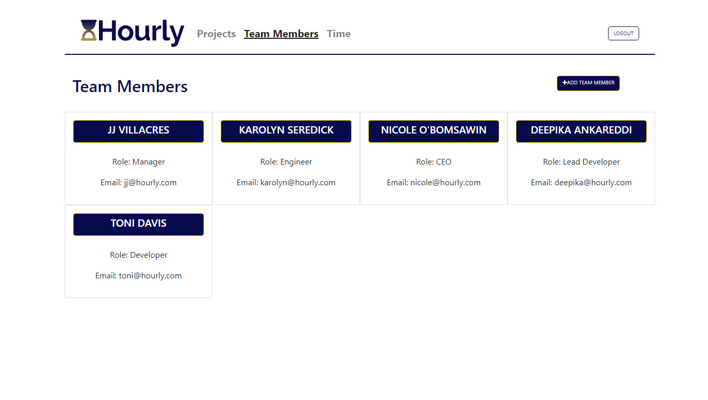

# Portfolio Page

,,,

## DESCRIPTION
 
As a novice full stack developer, I want to showcase my accomplishments by creating a professional portfolio page. 
My personal portfolio page was created to cumulate the projects I have created since starting my full stack career. 
As another member of a growing industry, I want to have a webpage that will hold my career resume and project in one place. 
This will show prospect employers what my capabilities are when using my full stack skills. 
My project will help me stand out from other developers in that it will keep updating with the most recent projects.   

## Table of Contents

* [Installation](#installation)

* [Usage](#usage)

* [Credits](#credits)

* [License](#License)

* [Contributing](#contributing)

* [Tests](#tests)

* [Questions](#questions)
      
## INSTALLATION

Click on the link above.

## USAGE

Updated site includes the following content: Name, Links to GitHub profile & LinkedIn page as well as email address and phone number, A link to a PDF of my resume, A list of projects (which include the following: Project title, Link to the deployed version, Link to the GitHub repository, Screenshot of the deployed application shown below).

Click name for link to github repository

* [Password Generator](https://github.com/noobatl/Password-Generator)

* [Work Day Scheduler](https://github.com/noobatl/Work-Day-Scheduler)

* [ReadMe Generator](https://github.com/noobatl/README-Generator)

* [Employee Management System](https://github.com/noobatl/Employee-Management-System)

* [ConcertHunt Project](https://github.com/noobatl/concerthunt)
    

* [Hourly Project](https://github.com/noobatl/hourly-project)

  
## CREDITS

No collaborators in this version.
HTML, CSS, JS, JQuery, Node.js, React, Git, Heroku. 

  
## LICENSE

MIT License Copyright (c) 2020. Permission is hereby granted, free of charge, to any person obtaining a copy of this software and associated documentation files (the 'Software'), to deal in the Software without restriction, including without limitation the rights to use, copy, modify, merge, publish, distribute, sublicense, and/or sell copies of the Software, and to permit persons to whom the Software is furnished to do so, subject to the following conditions: The above copyright notice and this permission notice shall be included in all copies or substantial portions of the Software. THE SOFTWARE IS PROVIDED 'AS IS', WITHOUT WARRANTY OF ANY KIND, EXPRESS OR IMPLIED, INCLUDING BUT NOT LIMITED TO THE WARRANTIES OF MERCHANTABILITY, FITNESS FOR A PARTICULAR PURPOSE AND NONINFRINGEMENT. IN NO EVENT SHALL THE AUTHORS OR COPYRIGHT HOLDERS BE LIABLE FOR ANY CLAIM, DAMAGES OR OTHER LIABILITY, WHETHER IN AN ACTION OF CONTRACT, TORT OR OTHERWISE, ARISING FROM, OUT OF OR IN CONNECTION WITH THE SOFTWARE OR THE USE OR OTHER DEALINGS IN THE SOFTWARE.
  
## CONTRIBUTING

Please note that this project is released with a Contributor Code of Conduct. By participating in this project you agree to abide by its terms.
  
## TESTS

npm test

## QUESTIONS

Username: noobatl

Email: info@noobusa.com

If you have any questions about this repo, open an issue or contact [JJ Villacres](https://github.com/noobatl) directly at the email above.
